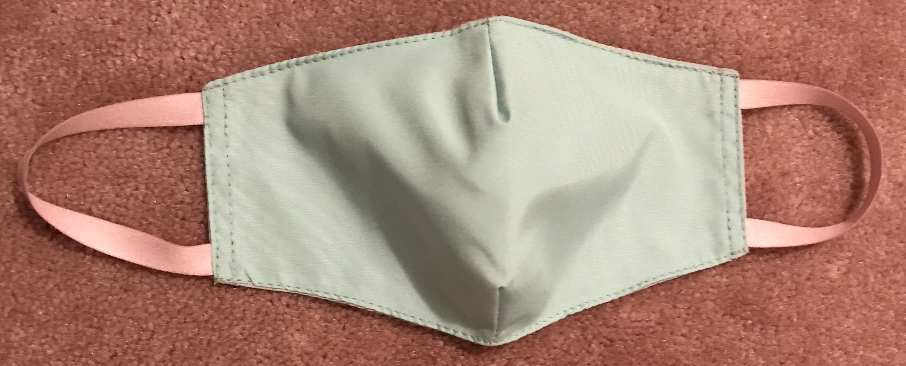
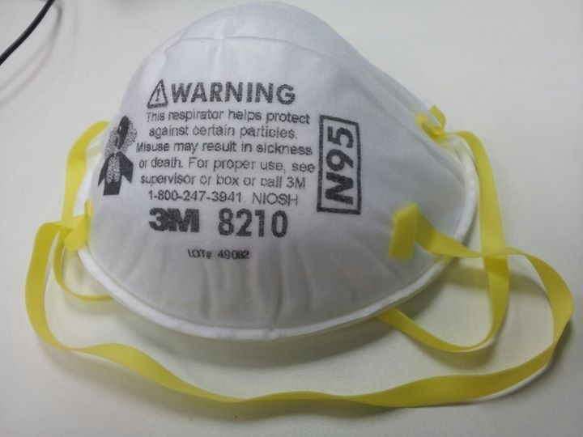
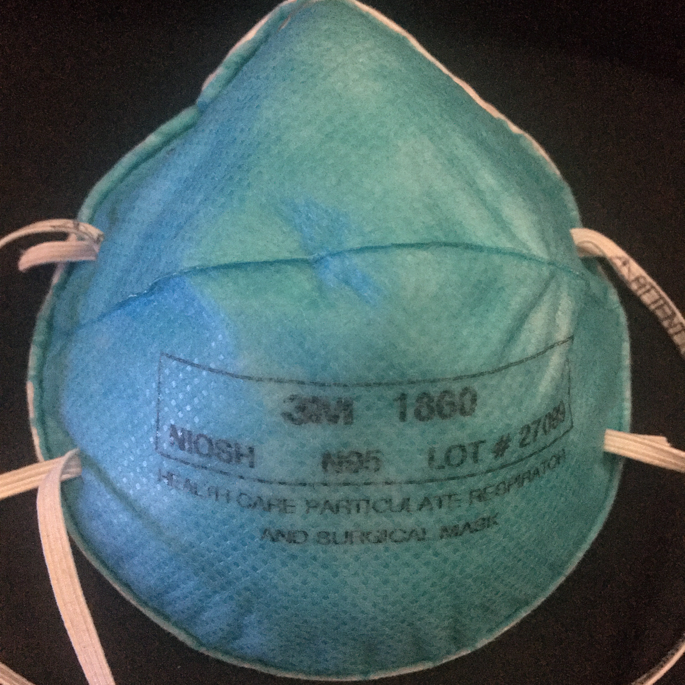
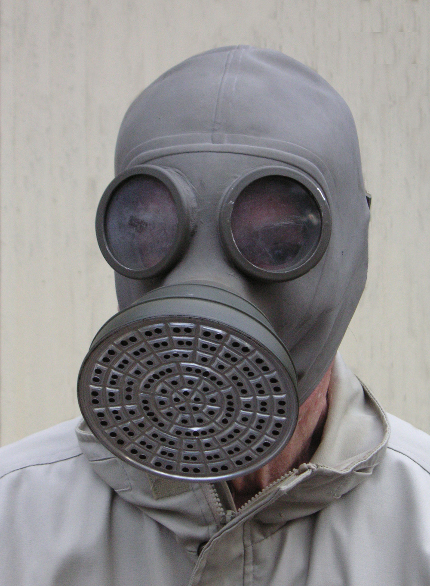
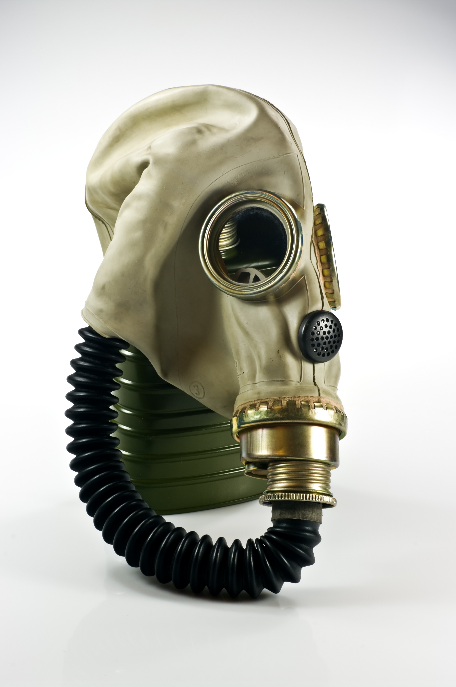
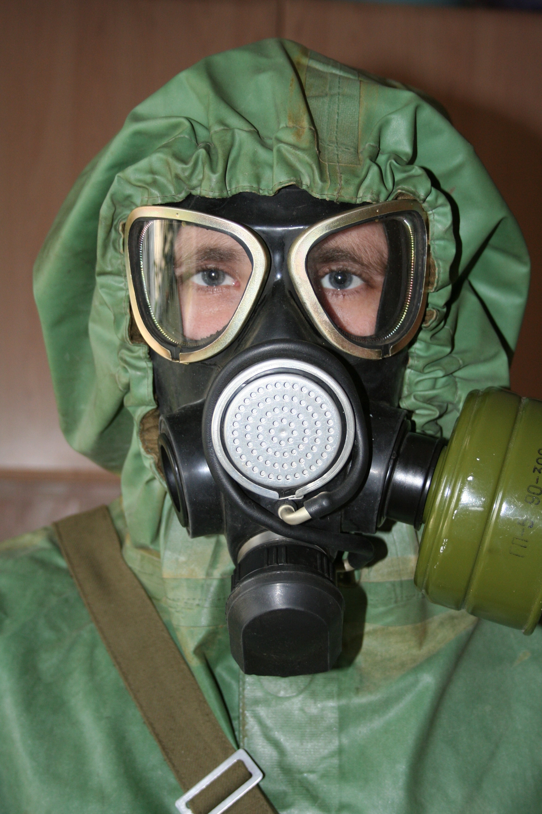

***

# Put on your mask

This page will help you enable a mask so you can safely view the other terminal scripts without getting a terminal illness.

What type of mask would you like?

[Regular](#Regular)

[Surgical](#Surgical)

[Gas mask](#Gas-mask)

[No mask (not recommended)](DisableMask.md)

Select an option from above.

***

```Python
# Start of script
#
#
#
#
#
#
print ("Hello world")
#
#
#
#
#
#
# End of script
```

***

# Regular

Choose a cloth mask to put on:



[[Enable this mask]](#Mask-enabled)

Currently, we only have 1 type of cloth mask.

***

```C
// Start of script
//
//
//
//
//
//
print ("Hello world")
//
//
//
//
//
//
// End of script
```

***

# Surgical

Choose a surgical mask to put on:



[[Enable this mask]](#Mask-enabled)



[[Enable this mask]](#Mask-enabled)

Currently, we only have 2 types of surgical masks.

***

```Python
# Start of script
#
#
#
#
#
#
print ("Hello world")
#
#
#
#
#
#
# End of script
```

***

# Gas mask

A little bit extreme, but it works.

Choose a gas mask to put on



[[Enable this mask (1930s gas mask)]](#Mask-enabled)



[[Enable this mask (1940s Polish gas mask]](#Mask-enabled)



[[Enable this mask (Soviet PMK Gas mask)]](#Mask-enabled)

***

@

@

@

@

@

@

@

@

@

@

@

@

@

@

@

@

@

@

@

@

@

@

@

@

@

@

@

@

@

@

***

# Mask enabled

You have successfully put on your mask. You are now a bit safer for your visit to the code terminal. To be even safer, make sure to also stay at least 6 feet (1.8288 meters, or 72 inches) away from the other script

[Visit the code hospital](../Code-distancing/README.md)

***

# File info

File type: `Markdown (*.md)`

File version: `1 (Sunday, February 28th 2021 at 4:39 pm)`

Line count (including blank lines and compiler line): `269`

***

# Current issues

1. A better plot needs to be written

2. Filled space in between each option may not fully give the illusion of going through step on separate pages

3. Need more mask types

4. Other (submit an idea)

***

# File history

## Version 1 (Sunday, February 28th 2021 at 4:39 pm)

> Changes:

> * Started the file

> * Added some options

> * Referenced 6 mask images

> * Added the regular mask section

> * Added the surgical mask section

> * Added the gas mask section

> * Added the mask enabled section

> * Added the file info section

> * Added the current issues section

> * Added the file history section

> * Added the footer

> * No other changes in version 1

## Version 2 (Coming soon)

> Changes:

> * Coming soon

> * No other changes in version 2

***

## Footer

You have reached the end of this file.

### EOF

***

